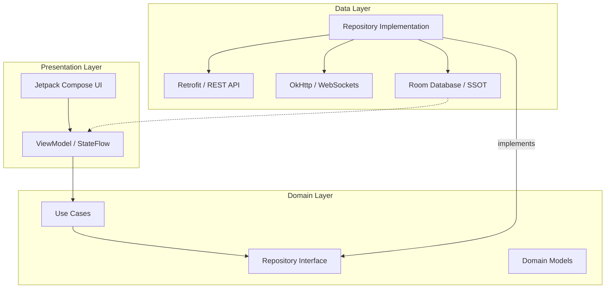
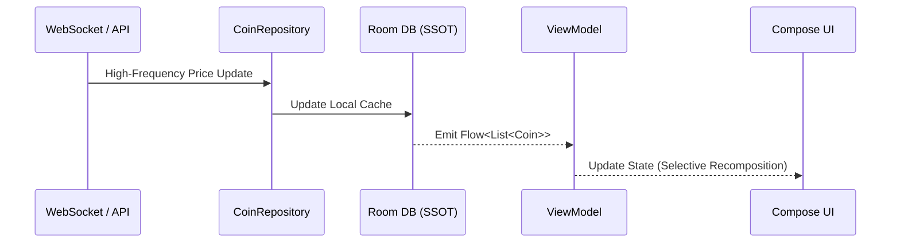

# CoinStream 📈

An SDE-2 level architectural showcase demonstrating a real-time, offline-first Android application.

CoinStream is a cryptocurrency dashboard that merges a traditional REST API baseline with high-frequency WebSocket streams, ensuring immediate UI reactivity without frame drops, all wrapped in a strictly modular Clean Architecture.

## 🏗 Architecture & Tech Stack
The project follows **Clean Architecture** principles, ensuring a strict separation of concerns between UI, business logic, and data ingestion.

*   **UI/Presentation:** Pure Jetpack Compose using `StateFlow` and precise recomposition scoping for high-frequency data updates.
*   **Architecture:** MVVM with Uncle Bob's Clean Architecture (Presentation -> Domain -> Data).
*   **Concurrency:** Kotlin Coroutines & Flows for handling asynchronous WebSocket emissions and database observing.
*   **Network (REST):** Retrofit2 + OkHttp for fetching the initial market baseline (CoinGecko/CoinCap API).
*   **Network (Live Data):** OkHttp WebSockets for establishing a persistent, real-time price stream (Binance).
*   **Local Persistence (Offline-First):** Room Database as the **Single Source of Truth (SSOT)**.
*   **Dependency Injection:** Dagger-Hilt for decoupled, testable module provision.

## 🔄 Data Flow & Synchronization
The application uses a reactive data flow where the UI never communicates directly with the network.

## ⚡ Key Optimizations & Engineering Challenges

### 1. Hybrid Monitoring Strategy
To ensure reliability, the app implements a **Hybrid Monitor**. It prioritizes high-frequency WebSocket streams for real-time updates but automatically falls back to REST polling if the connection is lost, ensuring the user always sees current data.

### 2. High-Frequency Recomposition Control
Handling sub-second price updates can be expensive for UI rendering. We optimized this by:
*   Using `remember` and `derivedStateOf` to limit recomposition scopes.
*   Keying `LazyColumn` items to prevent unnecessary re-drawing of the entire list.
*   Separating static coin data from volatile price updates in the UI state.

### 3. Offline-First Resilience
Room serves as the Single Source of Truth. The app immediately loads from the local cache upon launch. Network updates are merged into the database, and the UI reacts purely to database emissions via Flow, providing a seamless experience even with intermittent connectivity.

### 4. Sequence Consistency
WebSockets can sometimes deliver out-of-order packets. The repository utilizes `eventTime` or sequence markers from the API to ensure that older updates never overwrite newer data in the database.

### 5. Lifecycle-Aware Streams
WebSocket connections are strictly tied to the application/UI lifecycle using `CoroutineScope`. This prevents memory leaks and unnecessary background battery drain when the app is in the background.

## 🚀 Getting Started
1. Clone the repository.
2. Sync Project with Gradle Files.
3. Run the `app` module on an emulator or physical device.
